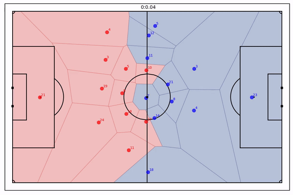
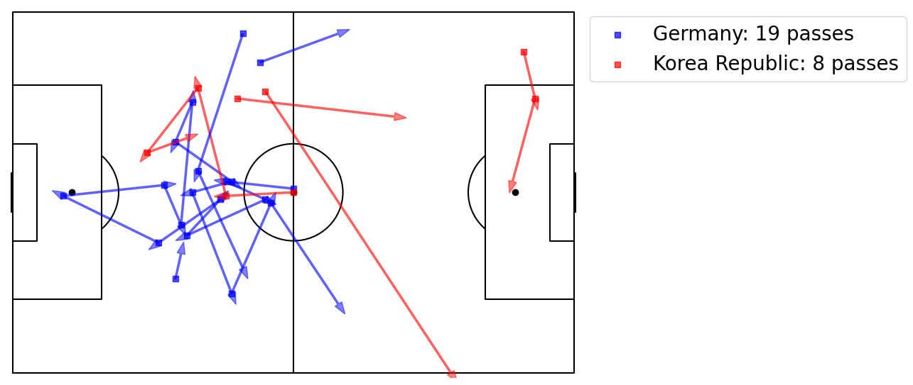
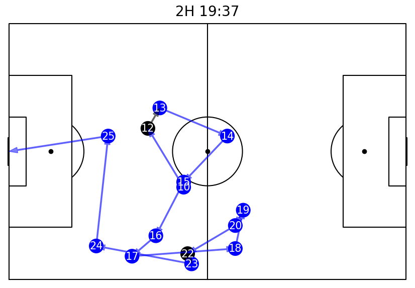
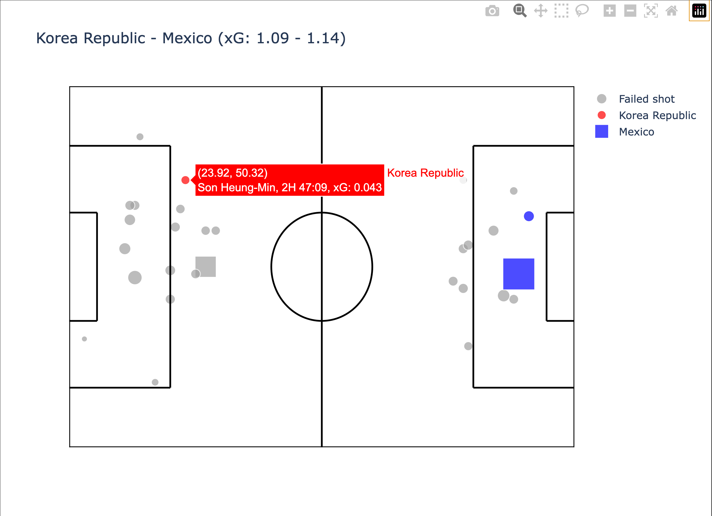
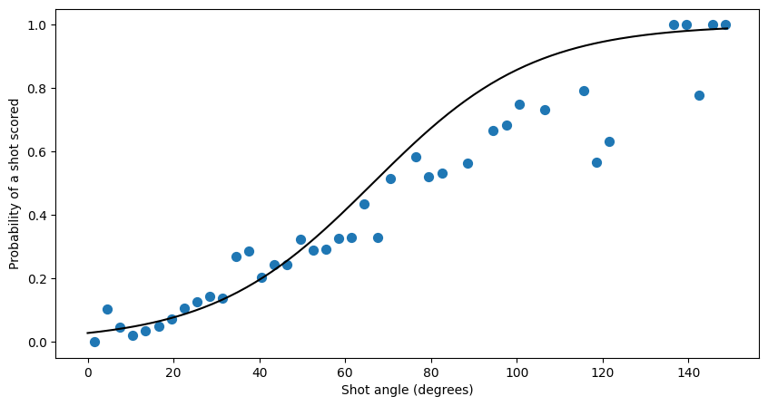
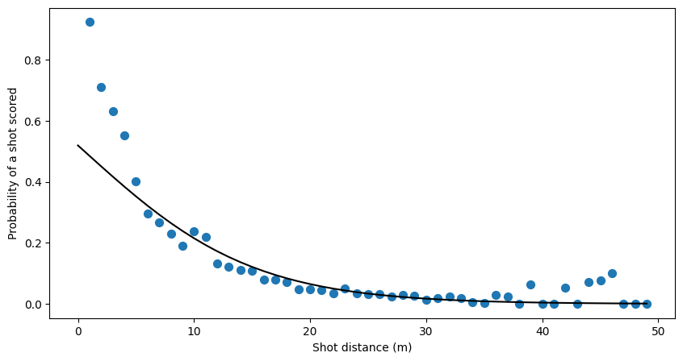

# 나만의 축구 경기 분석 솔루션 - 방구석FC⚽️

## Project Overview⚽️
----

#### 개발환경
conda 가상환경 생성
* python3.8
* requirements.txt 패키지 설치
<br>
<br>


#### 사용 DATA
wyscout soccer match event dataset 사용
* Version 5 사용
* https://figshare.com/collections/Soccer_match_event_dataset/4415000/5
<br>
<br>
<br>

#### 개발목적
방구석FC 프로젝트는 축구 경기 이벤트 데이터를 가공하여 경기에서 발생하는 이벤트를 분석할 수 있는 시각화 자료를 제공하는 것을 목표로 합니다.
1. 패스 경로 시각화
2. 공격이벤트 스퀀스 시각화
3. 선수별, 경기별 히트맵 시각화
4. 대회별, 선수별 xG 시각화

<br>

시각화된 자료를 바탕으로 각 경기별 선수별 행동 패턴, 팀의 전략, 슛의 기대득점 포퍼먼스 등에 대한 통찰력을 제공합니다.

해당 data는 wyscout soccer에서 제공하는 7개의 리그(대회)의 데이터를 활용하였으며,
101-파이형 인간님의 코드를 활용(수정 및 가공)하였습니다.

Logistic Regression 머신러닝 모델을 사용하여 로지스틱 회귀 분석을 수행하였으며,
방구석에서 축구를 즐기는 많은 이들에게 조금 더 전문적인 시점에서의 축구를 감상할 수 있도록 돕습니다.

<br>




<br>

### 개발언어
* python
<br>
<br>

### 사용 라이브러리
1. numpy
2. pandas
3. matplotlib
4. plotly

<br>
<br>

### 솔루션 구성
1. data: 시각화에 필요한 데이터들이 들어있습니다.
  * 필요의 경우 직접 데이터 파일을 해당 폴더에 넣어주세요.
2. img: 시각화한 파일들이 저장됩니다.
3. scr: 솔루션 실행에 필요한 코드들이 들어있습니다.
4. xgml.py: xG 머신러닝 코드입니다.
5. requirements.txt 솔루션 실행에 필요한 패키지 목록입니다.
6. output.png: README.md를 위한 파일입니다.
7. 1~5.ipynb: 솔루션을 실질적으로 동작시키는 파일입니다.
  * 각 파일별로 순서에 맞게 실행시키셔야 합니다.

<br>
<br>


## 실행 방법 및 코드&결과 예시
----

#### 1. 데이터 준비 
#### 데이터를 준비함으로써, 방구석FC 솔루션 이용을 준비합니다.

* <span style="color:skyblue">**"1 데이터 준비ipynb"**</span> 파일을 통해 refinde_events파일을 준비해주세요.
    * 데이터가 크기가 너무 커 github에는 월드컵 데이터만 업로드 하였습니다. 1 데이터 준비 파일을 통해 다른 대회 데이터를 다운 받을 수 있습니다.


<br>

#### 2. 원하는 경기 찾기
#### 응원하는 팁의 경기 정보를 분석하기 위한 준비 과정입니다.
* <span style="color:skyblue">**"2 분석 희망 데이터 찾기.ipynb"**</span> 파일을 통해 분석을 희망하는 경기의 match_id를 준비하세요.
    * 각 대회별 참여 팀의 정보를 확인한 뒤, 분석을 희망하는 팀의 경기를 찾아 match_id를 획득합니다.


```python
import pandas as pd
dataset_name = 'World_Cup'
#원하는 대회의 이름을 dataset_name으로 변경하면 정보 확인이 가능합니다.
#ex) England, European_Championship, France, Germany, Italy, Spain, World_Cup
match_df = pd.read_csv(f'data/refined_events/{dataset_name}/matches.csv', index_col=0, encoding='utf-8-sig')
match_df

```


<div>
<style scoped>
    .dataframe tbody tr th:only-of-type {
        vertical-align: middle;
    }

    .dataframe tbody tr th {
        vertical-align: top;
    }

    .dataframe thead th {
        text-align: right;
    }
</style>
<table border="1" class="dataframe">
  <thead>
    <tr style="text-align: right;">
      <th></th>
      <th>gameweek</th>
      <th>datetime</th>
      <th>venue</th>
      <th>team1_id</th>
      <th>team1_name</th>
      <th>team1_goals</th>
      <th>team2_id</th>
      <th>team2_name</th>
      <th>team2_goals</th>
      <th>duration</th>
    </tr>
    <tr>
      <th>match_id</th>
      <th></th>
      <th></th>
      <th></th>
      <th></th>
      <th></th>
      <th></th>
      <th></th>
      <th></th>
      <th></th>
      <th></th>
    </tr>
  </thead>
  <tbody>
    <tr>
      <th>2057954</th>
      <td>1</td>
      <td>2018-06-14 15:00:00</td>
      <td>Olimpiyskiy stadion Luzhniki</td>
      <td>14358</td>
      <td>Russia</td>
      <td>5</td>
      <td>16521</td>
      <td>Saudi Arabia</td>
      <td>0</td>
      <td>Regular</td>
    </tr>
    <tr>
      <th>2057955</th>
      <td>1</td>
      <td>2018-06-15 12:00:00</td>
      <td>Stadion Central'nyj</td>
      <td>16129</td>
      <td>Egypt</td>
      <td>0</td>
      <td>15670</td>
      <td>Uruguay</td>
      <td>1</td>
      <td>Regular</td>
    </tr>
    <tr>
      <th>2057961</th>
      <td>1</td>
      <td>2018-06-15 15:00:00</td>
      <td>Stadion Krestovskyi</td>
      <td>16216</td>
      <td>Morocco</td>
      <td>0</td>
      <td>10840</td>
      <td>Iran</td>
      <td>1</td>
      <td>Regular</td>
    </tr>
    <tr>
      <th>2057960</th>
      <td>1</td>
      <td>2018-06-15 18:00:00</td>
      <td>Olimpiyskiy Stadion Fisht</td>
      <td>9905</td>
      <td>Portugal</td>
      <td>3</td>
      <td>1598</td>
      <td>Spain</td>
      <td>3</td>
      <td>Regular</td>
    </tr>
    <tr>
      <th>2057966</th>
      <td>1</td>
      <td>2018-06-16 10:00:00</td>
      <td>Kazan' Arena</td>
      <td>4418</td>
      <td>France</td>
      <td>2</td>
      <td>8493</td>
      <td>Australia</td>
      <td>1</td>
      <td>Regular</td>
    </tr>
    <tr>
      <th>...</th>
      <td>...</td>
      <td>...</td>
      <td>...</td>
      <td>...</td>
      <td>...</td>
      <td>...</td>
      <td>...</td>
      <td>...</td>
      <td>...</td>
      <td>...</td>
    </tr>
    <tr>
      <th>2058012</th>
      <td>0</td>
      <td>2018-07-07 18:00:00</td>
      <td>Olimpiyskiy Stadion Fisht</td>
      <td>14358</td>
      <td>Russia</td>
      <td>2</td>
      <td>9598</td>
      <td>Croatia</td>
      <td>2</td>
      <td>Penalties</td>
    </tr>
    <tr>
      <th>2058014</th>
      <td>0</td>
      <td>2018-07-10 18:00:00</td>
      <td>Stadion Krestovskyi</td>
      <td>4418</td>
      <td>France</td>
      <td>1</td>
      <td>5629</td>
      <td>Belgium</td>
      <td>0</td>
      <td>Regular</td>
    </tr>
    <tr>
      <th>2058015</th>
      <td>0</td>
      <td>2018-07-11 18:00:00</td>
      <td>Olimpiyskiy stadion Luzhniki</td>
      <td>9598</td>
      <td>Croatia</td>
      <td>2</td>
      <td>2413</td>
      <td>England</td>
      <td>1</td>
      <td>ExtraTime</td>
    </tr>
    <tr>
      <th>2058016</th>
      <td>0</td>
      <td>2018-07-14 14:00:00</td>
      <td>Stadion Krestovskyi</td>
      <td>5629</td>
      <td>Belgium</td>
      <td>2</td>
      <td>2413</td>
      <td>England</td>
      <td>0</td>
      <td>Regular</td>
    </tr>
    <tr>
      <th>2058017</th>
      <td>0</td>
      <td>2018-07-15 15:00:00</td>
      <td>Olimpiyskiy stadion Luzhniki</td>
      <td>4418</td>
      <td>France</td>
      <td>4</td>
      <td>9598</td>
      <td>Croatia</td>
      <td>2</td>
      <td>Regular</td>
    </tr>
  </tbody>
</table>
<p>64 rows × 10 columns</p>
</div>


<br>

#### 월드컵에 참가한 팀 중 한국을 분석하고 싶다면
#### 한국팀이 뛴 경기만을 불러와 match_id를 획득한다.


```python
myteam = 'Korea Republic'
match_df[(match_df['team1_name'] == myteam) | (match_df['team2_name'] == myteam)]
```


<div>
<style scoped>
    .dataframe tbody tr th:only-of-type {
        vertical-align: middle;
    }

    .dataframe tbody tr th {
        vertical-align: top;
    }

    .dataframe thead th {
        text-align: right;
    }
</style>
<table border="1" class="dataframe">
  <thead>
    <tr style="text-align: right;">
      <th></th>
      <th>gameweek</th>
      <th>datetime</th>
      <th>venue</th>
      <th>team1_id</th>
      <th>team1_name</th>
      <th>team1_goals</th>
      <th>team2_id</th>
      <th>team2_name</th>
      <th>team2_goals</th>
      <th>duration</th>
    </tr>
    <tr>
      <th>match_id</th>
      <th></th>
      <th></th>
      <th></th>
      <th></th>
      <th></th>
      <th></th>
      <th></th>
      <th></th>
      <th></th>
      <th></th>
    </tr>
  </thead>
  <tbody>
    <tr>
      <th>2057985</th>
      <td>1</td>
      <td>2018-06-18 12:00:00</td>
      <td>Stadion Nizhny Novgorod</td>
      <td>7047</td>
      <td>Sweden</td>
      <td>1</td>
      <td>14855</td>
      <td>Korea Republic</td>
      <td>0</td>
      <td>Regular</td>
    </tr>
    <tr>
      <th>2057987</th>
      <td>2</td>
      <td>2018-06-23 15:00:00</td>
      <td>Rostov Arena</td>
      <td>14855</td>
      <td>Korea Republic</td>
      <td>1</td>
      <td>15473</td>
      <td>Mexico</td>
      <td>2</td>
      <td>Regular</td>
    </tr>
    <tr>
      <th>2057988</th>
      <td>3</td>
      <td>2018-06-27 14:00:00</td>
      <td>Kazan' Arena</td>
      <td>14855</td>
      <td>Korea Republic</td>
      <td>2</td>
      <td>3148</td>
      <td>Germany</td>
      <td>0</td>
      <td>Regular</td>
    </tr>
  </tbody>
</table>
</div>


<br>
<br>

#### 3. 패스, 슈팅의 시각화
#### 원하는 시간대에서 일어난 패스, 슈팅 내용을 시각화하여 볼 수 있습니다.
* <span style="color:skyblue">**"3 패스, 슈팅 시각화.ipynb"**</span> 파일을 통해 원하는 경기 시간대의 패스, 슈팅 내용을 확인해보세요.
    * match_id, 분석을 희망하는 시작 ~ 종료 시간,리그 이름을 넣어주셔야 합니다.

    <br>

* match_id 2057988 대한민국 vs 독일의 경기 0~1분 사이에 발생한 패스에 대한 시각화입니다.


```python
#위, 아래, 중간 코드는 생략 되었습니다. ( 결과물 출력 후 ipynb에서 삭제처리)
# 3 패스 시각화.ipynb에서 실행 해주세요.

match_id = 2057988 #원하는 경기의 match_id로 변경해보세요.
dataset_name = 'World_Cup'

start_time = 0  # 원하는 시작 시간을 입력하세요.(분)
end_time = 1  # 원하는 종료 시간을 입력하세요.(분)

draw_pitch('white', 'black')
#경기장을 그려주는 코드 (인자1 = 배경색, 인자2 = 라인색)

plt.legend(fontsize=20, bbox_to_anchor=(1, 1))
#plt.savefig('img/pass_arrow.png', bbox_inches='tight')
plt.show()
```


    

    


<br>
<br>

#### 4. 공격 이벤트 시퀀스 시각화
#### 어떤 방법으로 공격을 진행했는지 한눈에 볼 수 있습니다.
* <span style="color:skyblue">**"4 공격 이벤트 스퀀스 시각화.ipynb"**</span> 파일을 통해 원하는 경기 공격 진행 내용을 확인해보세요.
    * 분석을 희망하는 match_id, 리그 이름을 넣어주셔야 합니다. ("2 분석 희망 데이터 찾기.ipynb" 참고)
    * 원하는 공격 스퀀스(seq_id)를 찾아서 입력해주셔야 합니다.

* 공격 스퀀스란?: 공을 스틸 당하거나, 패스 미스, 전/후반 종료, 라인 아웃 등의 상황이 일어나지 않고 지속적으로 공격권이 유지되는 시간을 하나의 스퀀스로 봅니다.
  * <span style="color:skyblue">**"4 공격 이벤트 스퀀스 시각화.ipynb"**</span>파일이 실행되면 자동으로 공격 스퀀스를 나눠집니다.

<br>

* 아래 예시 코드와 출력물은 World_Cup의 match_id = 2058017 프랑스 vs 크로아티아 경기의 132 seq_id의 공격 경로 입니다.
  * 선택한 공격 스퀀스의 공격 경로가 시각화됩니다.
  * 아래 표를 바탕으로 어떤 선수가 어떤 이벤트를 진행시켰는지 순서에 맞게 정리됩니다.
     * 이벤트_id 십의자리가 공격 경로 시각화 번호로 사용됩니다.


```python
#위에 코드는 생략 되었습니다. ( 결과물 출력 후 ipynb에서 삭제처리)
# 4 공격 이벤트 스퀀스 시각화.ipynb에서 실행 해주세요.
seq_id = 132
first_idx = seq_records.at[seq_id, 'first_idx']
last_idx = seq_records.at[seq_id, 'last_idx']
visualize_sequence(match_events, first_idx, last_idx)
```


    

    


</style>
<table border="1" class="dataframe">
  <thead>
    <tr style="text-align: right;">
      <th></th>
      <th>display_time</th>
      <th>team_name</th>
      <th>player_name</th>
      <th>event_type</th>
      <th>sub_event_type</th>
      <th>tags</th>
    </tr>
  </thead>
  <tbody>
    <tr>
      <th>1010</th>
      <td>2H 19:08</td>
      <td>France</td>
      <td>B. Matuidi</td>
      <td>Pass</td>
      <td>Simple pass</td>
      <td>[Accurate]</td>
    </tr>
    <tr>
      <th>1011</th>
      <td>2H 19:10</td>
      <td>France</td>
      <td>A. Griezmann</td>
      <td>Duel</td>
      <td>Ground attacking duel</td>
      <td>[Neutral, Accurate]</td>
    </tr>
    <tr>
      <th>1012</th>
      <td>2H 19:10</td>
      <td>Croatia</td>
      <td>M. Brozović</td>
      <td>Duel</td>
      <td>Ground defending duel</td>
      <td>[Neutral, Accurate]</td>
    </tr>
    <tr>
      <th>1013</th>
      <td>2H 19:12</td>
      <td>France</td>
      <td>A. Griezmann</td>
      <td>Pass</td>
      <td>Simple pass</td>
      <td>[Accurate]</td>
    </tr>
    <tr>
      <th>1014</th>
      <td>2H 19:14</td>
      <td>France</td>
      <td>S. N'Zonzi</td>
      <td>Pass</td>
      <td>Simple pass</td>
      <td>[Accurate]</td>
    </tr>
    <tr>
      <th>1015</th>
      <td>2H 19:16</td>
      <td>France</td>
      <td>P. Pogba</td>
      <td>Pass</td>
      <td>Simple pass</td>
      <td>[Accurate]</td>
    </tr>
    <tr>
      <th>1016</th>
      <td>2H 19:20</td>
      <td>France</td>
      <td>L. Hernández</td>
      <td>Pass</td>
      <td>Simple pass</td>
      <td>[Accurate]</td>
    </tr>
    <tr>
      <th>1017</th>
      <td>2H 19:21</td>
      <td>France</td>
      <td>B. Matuidi</td>
      <td>Pass</td>
      <td>Simple pass</td>
      <td>[Accurate]</td>
    </tr>
    <tr>
      <th>1018</th>
      <td>2H 19:24</td>
      <td>France</td>
      <td>P. Pogba</td>
      <td>Pass</td>
      <td>Simple pass</td>
      <td>[Accurate]</td>
    </tr>
    <tr>
      <th>1019</th>
      <td>2H 19:25</td>
      <td>France</td>
      <td>S. N'Zonzi</td>
      <td>Pass</td>
      <td>Simple pass</td>
      <td>[Accurate]</td>
    </tr>
    <tr>
      <th>1020</th>
      <td>2H 19:26</td>
      <td>France</td>
      <td>P. Pogba</td>
      <td>Pass</td>
      <td>Simple pass</td>
      <td>[Accurate]</td>
    </tr>
    <tr>
      <th>1021</th>
      <td>2H 19:28</td>
      <td>France</td>
      <td>L. Hernández</td>
      <td>Duel</td>
      <td>Ground attacking duel</td>
      <td>[Take on left, Won, Accurate]</td>
    </tr>
    <tr>
      <th>1022</th>
      <td>2H 19:28</td>
      <td>Croatia</td>
      <td>M. Mandžukić</td>
      <td>Duel</td>
      <td>Ground defending duel</td>
      <td>[Take on right, Sliding tackle, Lost, Not accu...</td>
    </tr>
    <tr>
      <th>1023</th>
      <td>2H 19:30</td>
      <td>France</td>
      <td>L. Hernández</td>
      <td>Others on the ball</td>
      <td>Acceleration</td>
      <td>[Accurate]</td>
    </tr>
    <tr>
      <th>1024</th>
      <td>2H 19:34</td>
      <td>France</td>
      <td>L. Hernández</td>
      <td>Pass</td>
      <td>Simple pass</td>
      <td>[Accurate]</td>
    </tr>
    <tr>
      <th>1025</th>
      <td>2H 19:37</td>
      <td>France</td>
      <td>K. Mbappé</td>
      <td>Shot</td>
      <td>Shot</td>
      <td>[Goal, Right foot, Opportunity, Position: Goal...</td>
    </tr>
  </tbody>
</table>
</div>


<br>
<br>

#### 5. 경기별 슈팅 차트와 xG 시각화
#### 분석 팀의 슈팅이 얼마나 위협적인 슈팅인지 머신러닝을 통해 확인해보세요.
* <span style="color:skyblue">**"5 슈팅 xG 시각화.ipynb"**</span> 파일을 통해 원하는 경기의 슈팅 차트와 xG를 확인해보세요.
    * 분석을 희망하는 match_id를 넣어주세요 ("2 분석 희망 데이터 찾기.ipynb" 참고)
    * xG는 슈팅별 골로 이어질 수 있는 확률에 대한 기대 값입니다.
    * Logistic Regression 모델로 로지스틱 회귀 분석을 수행하였습니다.
        * xgml.py는 101_파이형인간의 머신러닝 코드를 활용(수정 및 가공)하여 프로그래밍 하였습니다.

<br>

* git의 용량 문제로 기본 data는 월드컵 데이터만 포함됩니다.
    * 따라서 예시는 7개 대회 데이터 학습 결과가 아닌 월드컵 데이터만 학습된 결과입니다.
    * 7개 대회 데이터를 다운 받으신 후 실행하시면 더욱 정확한 결과 확인이 가능합니다.
    * <span style="color:skyblue">"1 데이터 준비.ipynb"</span>를 통해 7개 대회 데이터를 사용하세요.
    
<br>

* 아래 예시 코드와 출력물은 World_Cup의 match_id = 2057987 대한민국 vs 멕시코 경기의 슈팅 차트입니다.
  * 실제 실행 시에는 각 슈팅 포인트에 마우스를 올려두는 것만으로, 슈팅의 정보를 확인할 수 있습니다.
    * 슈팅 정보는 슈팅을 한 선수, xG, 시간, 위치에 대한 정보입니다.
  * 골로 연결된 슈팅 포인트는 각 팀의 색이 채워져 있습니다.
  * 네모 슈팅 포인트는 프리킥, 패널트킥입니다.
  * 슈팅 포인트의 크기는 xG가 높을수록 커집니다.
    


```python
#위에 코드는 생략 되었습니다. ( 결과물 출력 후 ipynb에서 삭제처리)
# 5 슈팅 xG 시각화.ipynb에서 실행 해주세요.
team1_xg = team1_shots['xg'].sum().round(2)
team2_xg = team2_shots['xg'].sum().round(2)
title = f"{team1_name} - {team2_name} (xG: {team1_xg} - {team2_xg})"
fig = go.Figure(data=[shot_trace, team1_goal_trace, team2_goal_trace], layout=get_pitch_layout(title))
fig.show()
```



<br>


#### 7개 대회 슈팅 데이터에 대한 로지스틱 회귀 모델 학습 시각화

<p float="left">
  
   
</p>

<br>
<br>

----

#### 스포스 데이터 사이언스 학계 전망

* 의료, 자연어, 컴퓨터 비젼에 대한 연구는 수 많은 인재들이 연구를 진행 중이지만, 스포츠 데이터 사이언스 분야에 대한 관심은 높지 않다.
* 하지만 축구 선수들의 몸 값은 천문학적이며 축구 업계는 여전히 정량적인 방법의 분석을 사용합니다.
* 따라서 스포츠 데이터 사이언스 분야의 잠재적 가치는 크다.
<br>

* 취미가 직업이 될 수도 있다는 생각을 하면서,
* 우선은 취미라도 축구 데이터를 활용하여 분석을 해보면 좋을 것 같습니다.

<br>

#### 시각화 데이터 활용 방법
* 공격 스퀀스 분석을 통해 팀의 공격 경향성을 분석하는 방법
    - https://dl.acm.org/doi/pdf/10.1145/3219819.3219832 논문 참조
* 선수의 이벤트 액션과 득점 기여도에 관한 분석 방법
    - https://arxiv.org/pdf/1802.07127.pdf 논문참조

<br>
<br>

----
## Reference🙏
* 101-파이형인간님께서 오픈해주신 코드를 기반으로 작성되었습니다.
    1. data_utils.py
    2. plot_utils.py

## Developer
* 22102167 길민규
